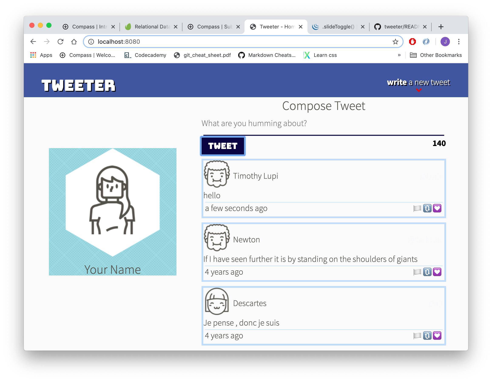

# Tweeter Project

Tweeter is a simple, single-page Twitter clone.

This repository is the starter code for the project: Students will fork and clone this repository, then build upon it to practice their HTML, CSS, JS, jQuery and AJAX front-end skills, and their Node, Express and MongoDB back-end skills.

## Final Product

#### Mobile and Desktop View

User can click 'write a new tweet' text on the right side of top nav bar to toggle slide open/close area to type in a new tweet. The textbox has limitation of 140 letters: inputs that are either over 140 letters or empty will be rejected with error message above textbox. Upon accepting appropriate length of text by clicking tweet button after typing in the text, new tweet will appear at the top of tweet list without need to reload the page.

## Getting Started

1. Fork this repository, then clone your fork of this repository.
2. Install dependencies using the `npm install` command.
3. Start the web server using the `npm run local` command. The app will be served at <http://localhost:8080/>.
4. Go to <http://localhost:8080/> in your browser.

## Dependencies

- Express
- Node 5.10.x or above
